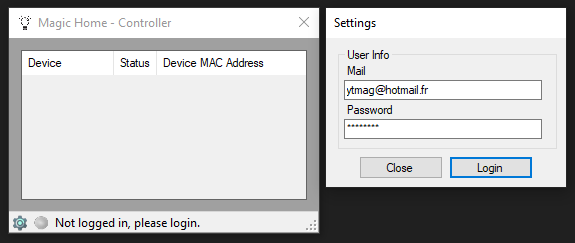

# MagicHue-API

A basic API and a *BETA* application (example of uses) for the Magic Hue RGB leds (https://play.google.com/store/apps/details?id=com.magichue.wifi&hl=fr)

Features:
- Login
- Import current account's devices
- Add devices by MAC address or IP
- Control Light
- System tray icon

I also made a .dll, for whatever

